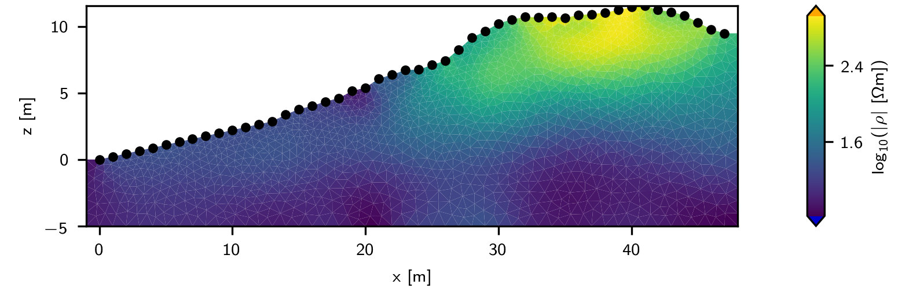

# CRTomo - Complex Resistivity Tomography

CRTomo is a finite-element forward (CRMod) and inversion (CRTomo) code for
complex electrical impedance data, written in Fortran. The code has been in
development since the early 1990s, and was used in numerous scientific
publications. Please refer to the section **scope** to assess whether you want
to use the code or not.

Main features:

* supports true 2D and 2.5D (constant y-resistivity distribution) forward and
  inverse modeling
* supports quadratic and triangular meshes with topography
* support modeling/inversion of the complex resistance, i.e. magnitude and
  phase values
* support for various regularization schemes (smooth, anisotropic in x/z
  directions, MGS)
* works on Windows and Linux

At the moment we do not publish binaries. You have to compile the code by
yourself to use it.

A companion project provides a work-in-progress python interface for the code
(https://github.com/geophysics-ubonn/crtomo_tools).

## Documentation

Documentation and installation instructions (so far as it exists) can be found
here for CRTomo:

https://geophysics-ubonn.github.io/crtomo_docs_all/crtomo_doc/index.html

Documentation for the crtomo_tools can be found here:

https://geophysics-ubonn.github.io/crtomo_docs_all/crtomo_tools/index.html

Note that these links point to static versions of the documentation, and are
not necessarily updated regularly.

## Scope

CRTomo has reached a mature state and at this point new features are only added
sporadically. If you are looking for a well-tested 2D/2.5D complex resistivity
inversion code, CRTomo could be something for you. If you are new to electrical
inversion and are looking for a general purpose inversion code/framework, have
a look at PyGimli (www.pygimli.org) and its associated electrical inversion
framework BERT (https://gitlab.com/resistivity-net/bert).

## Getting help

We appreciate any suggestions, improvements, and bug reports via the github
interfaces (issues, merge requests). Due to time constraints in the in general
we cannot provide detailed usage help. However, if you have interesting
research applications and would like to use CRTomo, drop us a line and lets see
what we can do.

In technical matters please contact Maximilian Weigand
(mweigand@geo.uni-bonn.de).

For research proposals/larger collaborations, please contact Prof. A. Kemna
(kemna@geo.uni-bonn.de).

## Cite as

For scientific research we would ask you to attribute usage using the following
citation:

	Kemna, A.: Tomographic inversion of complex resistivity – theory and
	application, Ph.D.  thesis, Ruhr-Universität Bochum,
	doi:10.1111/1365-2478.12013, 2000.

For technical documentation please cite either the full git commit hash, or (if
available) a specific release with its DOI.

## License

CRTomo and its components, if not otherwise stated, is distributed under the
MIT license. Please refer to the file **COPYING** for further information.

## Installation

For detailed installation instructions, please refer to:
https://geophysics-ubonn.github.io/crtomo_docs_all/crtomo_doc/misc/installation.html

If you are working under Linux with a git repository, run

	./autogen.sh

once to generate the necessary autotools files.

Otherwise, configure, compile, and install the program with

	./configure
	make
	make install

The default installation path points to $HOME/bin. You can change the
installation directory with

	./configure --prefix=$HOME/inst/

Run

	./clean_autotools.sh

to remove all auto-generated files.

## Distribution

After running ./configure, a source archive called "crtomomod*.tar.gz" can be
generated using

	make dist

## Debian Packaging

The command

	./prep_deb_package.sh

creates a Debian package in the "package/" subdirectory.

The version number can be set in **configure.ac**

## Limiting CPU usage

CRTomoMod is compiled using openmp. The number of CPU cores that are
facilitated can be controlled using the following environment variables:

	export OMP_THREAD_LIMIT=1
	export OMP_NUM_THREADS=1
	export OPENBLAS_NUM_THREADS=1

## TODO

We should restrict the calling of external shell scripts (git version, error
messages, etc) to the ./autogen.sh script, and remove them from configure.ac.
This simplifies the Debian package generation.

